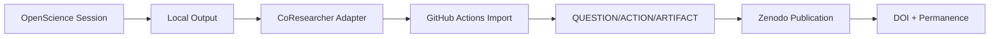

# External Agent Integration
## CoResearcher as the Scientific Coordination Layer

**Version 1.0.0** - Platform Architecture  
**Status**: Foundational Integration Document

---

## The Strategic Insight

CoResearcher is NOT another research agent.

CoResearcher IS **the coordination layer** that ALL research agents feed into.

Like GitHub coordinates VS Code, IntelliJ, Cursor, and Claude Code,

CoResearcher coordinates OpenScience, Claude Research, Gemini Deep Research, and future agents.

---

## The Integration Model

```
┌─────────────────────────────────────────────┐
│          RESEARCH AGENT ECOSYSTEM           │
│                                             │
│  OpenScience    Claude Research  Gemini      │
│  Codex          Antigravity                 │
│  Future Agents                              │
└─────────┬─────────────────┬─────────────────┘
          │                 │
          ▼                 ▼
    ┌─────────────────────────────────┐
    │  CoResearcher Coordination Layer │
    │                                   │
    │  QUESTION                         │
    │  ACTION                           │
    │  ARTIFACT                         │
    │  PROVENANCE                       │
    └───────────────────────────────────┘
```

---

## Integration Points

### 1. OpenScience → CoResearcher

```text
OpenScience
    ↓
Session executed → ACTION-XXXXX
Artifact generated → ART-XXXXX  
Claim extracted → CLAIM-XXXXX
Provenance stored locally → Exported to CoResearcher
```

Integration workflow:
```yaml
# .github/workflows/import-from-openscience.yml
inputs:
  session_path: /sessions/2026-alzheimer-biomarkers
  
steps:
  - extract: session.json → ACTION entries
  - extract: artifacts/*.json → ARTIFACT entries
  - extract: claims/*.json → CLAIM entries
  - generate: provenance chain
  - register: all in CoResearcher ledger
```

---

### 2. Claude Research → CoResearcher

```text
Claude Research
    ↓
Question answered → ACTION-REVIEW-XXXXX
Evidence cited → PROVENANCE linked
Methodology traced → PROMPT version recorded
Output → ARTIFACT-XXXXX
```

Integration webhook:
```javascript
// When Claude Research completes
const action = {
  type: "LITERATURE_REVIEW",
  actor: "claude-research",
  target: question_id,
  evidence: cited_papers,
  prompt_hash: used_prompt,
  timestamp: Date.now()
};
// POST to /actions/log
```

---

### 3. Gemini Deep Research → CoResearcher

```text
Gemini Research
    ↓
Deep dive → ACTION-RESEARCH-XXXXX
Follow-up questions → QUESTION-YYYYYY
Cross-references → REVIEW-YYYYYY
```

---

## The Universal Adapter

### Section 1. Common Interface

Any agent that produces:

```json
{
  "question": "What biomarkers predict Alzheimer?",
  "action_type": "RESEARCH",
  "method": {
    "model": "unknown",
    "prompt": "unknown",
    "tools_used": []
  },
  "outputs": {
    "claims": [],
    "artifacts": [],
    "files": []
  },
  "timestamp": "2026-07-13T00:00:00Z"
}
```

Can integrate with CoResearcher.

### Section 2. Adapter Patterns

| Agent | Adapter Type | Integration Point |
|-------|--------------|-------------------|
| OpenScience | Session Importer | Local disk → Ledger |
| Claude Research | API Listener | Webhook callback |
| Gemini Deep | Export Parser | Output JSON |
| Codex | Workflow Integrator | Actions YAML |
| Future Agents | Universal Adapter | Common schema |

---

## The Value Proposition

### For OpenScience Users

"We've done the research. Now we want to:"

- ✅ **Publish with DOI** (Zenodo integration)
- ✅ **Collaborate** (shared QUESTION/ACTION ledger)
- ✅ **Get credit** (for questions + actions + reviews)
- ✅ **Ensure reproducibility** (complete provenance chain)

### For Agent Developers

"Your agent generates work. We coordinate it:"

- ✅ **Capture** all agent outputs
- ✅ **Link** them to scientific questions  
- ✅ **Score** them for quality
- ✅ **Publish** them with permanence

---

## Integration Architecture

### Layer 1: Agents Produce

```
OpenScience Session
Claude Research Output
Gemini Deep Analysis
```

### Layer 2: Adapters Translate

```
JSON → CoResearcher ACTION
Files → CoResearcher ARTIFACT
Logs → CoResearcher PROVENANCE
```

### Layer 3: CoResearcher Coordinates

```
QUESTION (strategic anchor)
ACTION (verifiable operations)
ARTIFACT (published outputs)
PROVENANCE (immutable history)
```

---

## The OpenScience Opportunity

### Section 1. What They Have

- Research agents
- Workspace execution
- MCP integration
- Session management
- Local provenance
- Artifact production
- Multi-model support

### Section 2. What They Need

A way to:
- ✅ Publish to permanent record
- ✅ Collaborate with other researchers
- ✅ Track questions + answers systematically
- ✅ Generate DOI for artifacts
- ✅ Build on each other's work

This is CoResearcher.

---

## The Integration Workflow



---

## First Integration: OpenScience

### Prerequisites
- OpenScience stores session as JSON
- Session includes: question, actions, outputs, timestamps

### Integration Script (Minimal)

```python
# scripts/openscience-import.py
import json
import requests

def import_session(session_path):
    session = load_openscience_session(session_path)
    
    # Create QUESTION if needed
    question = create_question_if_new(session.question)
    
    # Log ACTION
    action = {
        "type": session.action_type,
        "actor": "openscience",
        "target": question.id,
        "method": extract_provenance(session),
        "outputs": session.outputs
    }
    log_action(action)
    
    # Update artifacts
    update_artifact_registry(session.artifacts)

# Usage: python import.py /path/to/session.json
```

---

## The Platform Strategy

### Don't Compete
- ❌ Don't build another agent
- ❌ Don't fork existing systems
- ❌ Don't duplicate agent capabilities

### Enable Coordination
- ✅ Provide QUESTION/ACTION ledger
- ✅ Offer DOI publication workflows
- ✅ Enable cross-agent collaboration
- ✅ Track provenance across systems
- ✅ Score quality continuously

---

## Success Metrics

### Short Term
- OpenScience session → CoResearcher ledger
- 1-click DOI publication from agent outputs
- Researchers get credit for agent-facilitated work

### Long Term
- 100+ agent integrations
- 10K+ cross-agent collaborations
- 100K+ DOI artifacts published
- Scientific Coordination Graph emerges naturally

---

*CoResearcher como plataforma, no como producto. La capa de coordinación universal para investigación agentic.*