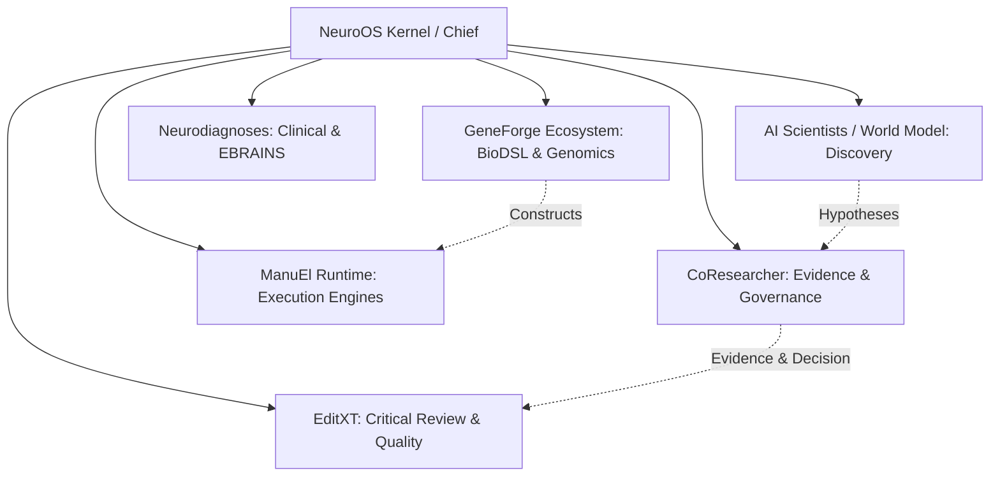

# Mapa Completo de Sistemas de NeuroOS (NeuroOS System Map)

**Versión:** 1.0.0  
**Gobernanza:** Directiva ANTIGRAVITY-001  
**Estado:** Canónico - Arquitectura de Orquestación Multiagente  

---

## 1. Visión General de NeuroOS

NeuroOS es el sistema operativo distribuido de orquestación multiagente. Su función no es ejecutar tareas científicas individuales ni reemplazar el conocimiento interno de los subsistemas, sino coordinar agentes especializados, garantizar el cumplimiento de las fronteras ontológicas y mantener la gobernanza, trazabilidad y observabilidad del ecosistema.

---

## 2. Inventario Completo de Sistemas

### 2.1 NeuroOS Kernel / Orquestador (Chief Agent & Memory)
* **Responsabilidad Exclusiva:** Orquestación multiagente, enrutamiento de misiones (`Briefs`), sincronización de políticas (`.neuroos-active-policy.yaml`), observabilidad transversal y memoria compartida del ecosistema.
* **Entradas:** `Briefs` de misiones globales, eventos de agentes, señales de heartbeat.
* **Salidas:** Asignación de misiones a runtime de agentes, directivas globales de sincronización.
* **Dependencias:** Ninguna (Es el plano de control).
* **Fronteras:** No ejecuta lógica de dominio científico ni edita directamente datos biológicos o documentos.

---

### 2.2 CoResearcher (Scientific Evidence & Governance Engine)
* **Responsabilidad Exclusiva:** 
  1. Trazabilidad computable inmutable de conocimiento (*EvidenceGraph*: Claims, Artifacts, Sources).
  2. Gobernanza direccional (*DecisionGraph*: Decisiones estratégicas).
  3. Estructuración de intenciones de trabajo (*MissionGraph*: Missions y Briefs).
* **Entradas:** Artículos científicos, datasets, solicitudes de estructuración de evidencia.
* **Salidas:** `EvidenceGraph` (DAG 100% acíclico), `DecisionGraph`, `MissionGraph` paquetes de `Briefs`.
* **Dependencias:** Ninguna.
* **Contratos:** `constitution_rules.yaml`, `EVIDENCEGRAPH_SPEC.md` v1.1.0, `ADR-DEC-001`, `ADR-EXE-001`.
* **Fronteras:** **FROZEN (ARQ-001 → ARQ-003)**. Prohibido emitir veredictos de calidad, puntuaciones de confianza (`trust_score`), generar hipótesis científicas o ejecutar código directo.

---

### 2.3 EditXT (Critical Review & Quality Assessment Engine)
* **Responsabilidad Exclusiva:** Auditoría de calidad, revisión de pares sintética, detección de inconsistencias lógicas en literatura/código y refactorización crítica.
* **Entradas:** `EvidenceGraph` exportado por CoResearcher o borradores de publicaciones.
* **Salidas:** `ReviewGraph` (Veredictos de Calidad, Severity Scores, Propuestas de Refactorización).
* **Dependencias:** `EvidenceGraph` de CoResearcher (como fuente de verdad factual).
* **Contratos:** `BOUNDARY_WITH_EDITXT.md`.
* **Fronteras:** No altera el `EvidenceGraph`. No genera evidencia primaria. Sus veredictos residen exclusivamente en la capa de EditXT.

---

### 2.4 AI Scientists / World Model (Generative Hypothesis & Simulation)
* **Responsabilidad Exclusiva:** Generación de hipótesis novedosas, simulación biofísica de modelos (World Model), diseño experimental in silico y descubrimiento prospectivo.
* **Entradas:** `EvidenceGraph` (para conocer el estado actual de la ciencia) y parámetros de simulación.
* **Salidas:** Candidatos a Hipótesis, Modelos Simulados, Diseños Experimentales.
* **Dependencias:** World Model, motores de inferencia estocástica.
* **Contratos:** `BOUNDARY_WITH_AI_SCIENTISTS.md`.
* **Fronteras:** No declara sus hipótesis como hechos demostrados. Cualquier hipótesis generada debe ingresar a CoResearcher como una nueva `Mission` para validación formal.

---

### 2.5 GeneForge / GeneForgeLang Ecosystem (Biomedical DSL & Genomics Compiler)
* **Responsabilidad Exclusiva:** Sintaxis, parsing (ej. `gf/parser.py`), compilación y validación de construcciones genómicas y modelos sintéticos de empalme/secuencia.
* **Entradas:** Código en sintaxis GFL, secuencias de nucleótidos/aminoácidos.
* **Salidas:** ASTs de GFL, secuencias validadas, predicciones de sitios de empalme.
* **Dependencias:** Parsers GFL locales.
* **Contratos:** Especificación de Sintaxis GFL (2-space indentation).
* **Fronteras:** Limitado a la capa de lenguaje sintético y genómica formal. No gobierna el flujo de agentes.

---

### 2.6 Neurodiagnoses (Clinical Platform & EBRAINS Integration)
* **Responsabilidad Exclusiva:** Aplicación clínica y neurodiagnóstica (Enfermedad de Creutzfeldt-Jakob, Demencia con Cuerpos de Lewy, Alzheimer), integración con la plataforma EBRAINS y datasets de pacientes reales.
* **Entradas:** Datos clínicos de pacientes, criterios diagnósticos (ej. McKeith et al., 2017), registros EEG/MRI.
* **Salidas:** Diagnósticos estructurados, criterios de peso (`weight_tier`), reportes clínicos de investigación.
* **Dependencias:** EBRAINS API, datasets reales de Fundación de Neurociencias.
* **Contratos:** Directiva de Rigor Científico (Prohibición absoluta de simular/mockear datos biológicos reales).
* **Fronteras:** Limitado al ámbito clínico y de investigación neurobiológica real.

---

### 2.7 ManuEl Runtime (Execution Engine & Daemon Agent Hosts)
* **Responsabilidad Exclusiva:** Runtime de ejecución en segundo plano (siempre activo), gestión de hilos de agentes (Claude Code, OpenCode, Codex) y almacenamiento persistente de estados operativos.
* **Entradas:** `Briefs` enviados por el Kernel de NeuroOS.
* **Salidas:** Logs de ejecución (`Execution` nodes), artefactos generados, estados de proceso.
* **Dependencias:** Entorno local de ejecución.
* **Contratos:** `schemas/mission_graph.yaml` (Nodo `Execution`).
* **Fronteras:** No toma decisiones estratégicas de investigación (eso pertenece a `DecisionGraph`).

---

## 3. Matriz de Contratos e Interfaces entre Sistemas

| Origen | Destino | Interfaz / Contrato | Formato de Intercambio | Propósito |
| :--- | :--- | :--- | :--- | :--- |
| **NeuroOS Kernel** | **ManuEl Runtime** | `Mission Dispatch API` | JSON (`Brief`) | Enviar paquete inmutable de trabajo a un agente. |
| **ManuEl Runtime** | **CoResearcher** | `Evidence Ingestion API` | JSON (`Artifact` / `Claim`) | Entregar resultados de ejecución comprobados. |
| **CoResearcher** | **EditXT** | `Evidence Export Interface` | JSON (`EvidenceGraph` v1.1.0) | Proveer el grafo inmutable para auditoría de calidad. |
| **AI Scientists** | **NeuroOS Kernel** | `Hypothesis Proposal Event` | Event / JSON | Proponer una nueva línea de investigación para evaluación de gobernanza. |
| **Neurodiagnoses** | **CoResearcher** | `Clinical Evidence Provider` | JSON (`Source` / `Artifact`) | Registrar evidencias clínicas reales validadas por EBRAINS. |
| **GeneForge** | **ManuEl Runtime** | `Genomic Compiler Target` | Código GFL / AST | Compilar construcciones biológicas para simulación/ejecución. |

---

## 4. Matriz de Riesgos de Solapamiento y Mitigaciones

| Riesgo de Solapamiento | Sistemas Involucrados | Mitigación Constitucional |
| :--- | :--- | :--- |
| **Invasión de Calidad en Trazabilidad** | CoResearcher ↔ EditXT | CoResearcher tiene prohibido emitir `ReviewFinding` o `scores`. EditXT consume el grafo pero escribe sus hallazgos en su propio `ReviewGraph`. |
| **Invasión Generativa en Evidencia** | AI Scientists ↔ CoResearcher | AI Scientists no puede inyectar Claims directamente en el `EvidenceGraph`. Debe pasar por una `Mission` aprobada en el `DecisionGraph`. |
| **Invasión de Gobernanza por Runtime** | ManuEl Runtime ↔ NeuroOS Kernel | Los agentes en ManuEl no pueden autorrediseñar sus misiones. Operan bajo el `Brief` inmutable recibido. |
| **Simulación de Datos Biológicos** | Neurodiagnoses ↔ Todo el Ecosistema | Violación crítica: Prohibición absoluta de stubbing/mocking en datos de EBRAINS o neurodiagnóstico. |

---

## 5. Criterio de Éxito de NeuroOS

El éxito de NeuroOS **no dependerá de añadir más características a CoResearcher**, sino de demostrar empíricamente que:
1. NeuroOS puede orquestar 3 o más de estos sistemas en una misión compleja sin conflictos de frontera.
2. Cada sistema mantiene 100% su responsabilidad exclusiva sin invadir la ontología de los demás.
3. La memoria compartida y la observabilidad transversal permiten recuperar cualquier traza desde el `Brief` de origen hasta el `Artifact` final.
