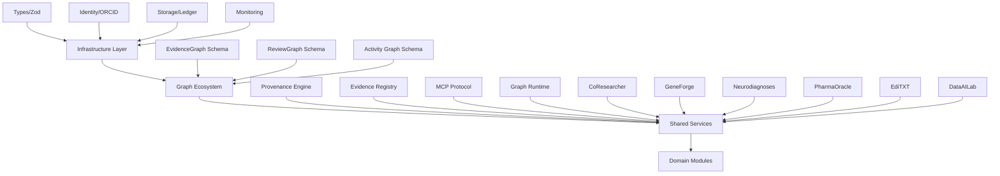

# RESEARCH PLATFORM ARCHITECTURE
**Version 1.0.0** - Multi-Platform Scientific Infrastructure  
**Status**: Canonical Reference  
**Platforms**: CoResearcher, GeneForge, Neurodiagnoses, PharmaOracle, EdiTXT, DataAILab

---

## 1. Architecture Philosophy

The research platform follows a **layered separation** model:

```
┌─────────────────────────────────────────────────────────────┐
│  DOMAIN MODULES (Specialized Applications)                  │
│  ┌──────────┬────────────┬──────────┬──────────┬──────────┐│
│  │CoResearcher│GeneForge │NeuroDiag │PharmaOracle│EdiTXT ││
│  └──────────┴────────────┴──────────┴──────────┴──────────┘│
├─────────────────────────────────────────────────────────────┤
│  SHARED SERVICES (Business Logic Layer)                     │
│  ┌────────────┬────────────┬────────────┬─────────────────┐│
│  │Provenance  │ Evidence   │  Graph     │  MCP Protocol   ││
│  │  Engine    │  Registry  │  Runtime   │                 ││
│  └────────────┴────────────┴────────────┴─────────────────┘│
├─────────────────────────────────────────────────────────────┤
│  GRAPH ECOSYSTEM (Data Structures & Schemas)                │
│  ┌────────────┬────────────┬────────────┬─────────────────┐│
│  │  Evidence  │  Review    │ Scientific │  Question/      ││
│  │   Graph    │   Graph    │  Activity  │  Action Schemas ││
│  └────────────┴────────────┴────────────┴─────────────────┘│
├─────────────────────────────────────────────────────────────┤
│  INFRASTRUCTURE (Common Platform Services)                  │
│  ┌────────────┬────────────┬────────────┬─────────────────┐│
│  │ Types      │ Identity   │ Storage    │  Monitoring     ││
│  │(Zod Schemas│(ORCID/ROR) │(Ledger)    │  & Logging      ││
│  └────────────┴────────────┴────────────┴─────────────────┘│
└─────────────────────────────────────────────────────────────┘
```

---

## 2. Layer Separation

### 2.1 Infrastructure Layer

**Purpose**: Platform-wide, technology-agnostic primitives

**Components**:
- **Type System**: Zod schemas for all domain objects (EvidenceGraph, ReviewGraph, Action, Claim, Question)
- **Identity Management**: ORCID (researchers), ROR (institutions)
- **Storage Backend**: Ledger persistence (SQLite, PostgreSQL)
- **Monitoring**: Google Cloud Logging/Monitoring integration
- **Cryptographic Utilities**: Hashing, signing, verification

**Dependencies**: None (leaf dependency)

---

### 2.2 Graph Ecosystem Layer

**Purpose**: Data structures and schemas for scientific knowledge representation

**Graphs**:
- **EvidenceGraph**: Directed Acyclic Graph for auditable claim traceability (CLAIM → ART → SOURCE → URL)
- **ReviewGraph**: Directed graph for peer review findings (EditXT-specific)
- **Scientific Activity Graph**: Temporal graph of QUESTION → ACTION → ARTIFACT relationships

**Schemas package** (`@coresearcher/types`):
```typescript
- evidence-graph.ts  // EvidenceGraph, EvidenceNode, EvidenceEdge
- review-graph.ts    // ReviewGraph, ReviewFinding, ReviewSeverity
- provenance.ts      // ExecutionTrace, ToolCall, DataLineage
- mcp.ts            // MCP tool definitions
```

**Interdependencies**: Depends on Infrastructure only

---

### 2.3 Shared Services Layer

**Purpose**: Reusable business logic across all domain modules

**Sub-layers**:

#### 2.3.1 Provenance Engine

```yaml
Location: packages/provenance/
Responsibilities:
  - Track execution traces (tool calls, prompts, data flow)
  - Compute data lineage (artifact provenance chains)
  - Cryptographically sign provenance records
  - Provide immutable audit trails

Exports:
  - ./engine       // ProvenanceEngine class
  - ./storage      // LedgerStorage interface
```

**Used by**: CoResearcher, GeneForge, Neurodiagnoses, PharmaOracle

#### 2.3.2 Evidence Registry

```yaml
Responsibilities:
  - Register and resolve EVID-XXXXXX artifacts
  - Track artifact relationships (derived_from, supersedes)
  - Compute evidence descriptors (source_count, support_depth)
  - Manage artifact lifecycle (immutable after registration)

Interfaces:
  - register(artifact: Artifact) → EVID-XXXXXX
  - resolve(id: EVID-XXXXXX) → Artifact
  - get_descriptors(claim: CLAIM-XXXXXX) → EvidenceDescriptors
```

**Used by**: CoResearcher, EdiTXT, DataAILab

#### 2.3.3 MCP Protocol Layer

```yaml
Location: packages/mcp-server/
Responsibilities:
  - Expose EvidenceRequest/EvidenceGraph API
  - Handle tool invocations from external agents
  - Rate limiting, authentication, validation
  - WebSocket support for real-time graph updates

Protocol Version: 1.0.0
```

**Used by**: All platforms (external integration point)

#### 2.3.4 Graph Runtime

```yaml
Responsibilities:
  - Construct EvidenceGraph from primitives
  - Validate graph constraints (acyclic, ≤3 hops, anchored)
  - Compute graph metrics (centrality, path lengths)
  - Serialize/deserialize graph formats (JSON, GraphML)

Engine: LangGraph (Python), custom DAG (TypeScript)
```

**Used by**: CoResearcher, DataAILab, GeneForge

---

### 2.4 Domain Modules Layer

**Purpose**: Specialized applications for specific scientific domains

**Modules**:

| Module | Domain | Primary Function | Key Components |
|--------|--------|------------------|----------------|
| **CoResearcher** | General Science | Traceability & audit | Observer, Semantic Compiler, Ledger Normalizer |
| **GeneForge** | Genomics | DSL for genomic workflows | GFL parser, CRISPR optimizer, evidence adapters |
| **Neurodiagnoses** | Neuroscience | Neuroimaging analysis | Clinical simulation, biomarker detection |
| **PharmaOracle** | Pharmacology | Drug discovery & repurposing | Molecular docking, ADMET prediction |
| **EdiTXT** | Scientific Editing | Peer review & revision | ReviewGraph generator, revision tracker |
| **DataAILab** | Data Science | Experimentation & ML | Model registry, experiment tracker |

**Architecture Pattern**: Each module is a standalone application that:
1. Consumes shared services (Provenance, Evidence Registry)
2. Produces domain-specific artifacts
3. Publishes to shared graph ecosystem
4. Exposes MCP tools for coordination

---

## 3. Dependency Graph



---

## 4. Communication Contracts

### 4.1 Internal Contracts

```
Provenance Engine → Domain Module
  Contract: emit_event(event: ScientificEvent) → void
  Guarantees: Immutable record, cryptographic integrity

Evidence Registry → Graph Runtime
  Contract: build_graph(artifacts: Artifact[]) → EvidenceGraph
  Guarantees: Acyclic, ≤3 hops, anchored claims

MCP Protocol → External Agent
  Contract: handle_request(req: EvidenceRequest) → EvidenceGraph
  Guarantees: Consistent response format, auth validation
```

### 4.2 External Contracts

```
External Agent → MCP Protocol
  Contract: POST /v1/trace { request_type, target, scope }
  Response: { graph_id, nodes, edges }

EditXT → CoResearcher
  Contract: POST /review { action_id, findings }
  Response: { review_id, status }

AI Scientist → CoResearcher
  Contract: GET /evidence/{question_id}
  Response: { evidence_graph }
```

---

## 5. Platform Matrix

| Platform | Language | Primary Graph | Evidence Registry | MCP Server | Domain Specialization |
|----------|----------|---------------|-------------------|------------|----------------------|
| CoResearcher | TypeScript/Python | EvidenceGraph, Activity Graph | ✅ | ✅ | Traceability |
| GeneForge | Python | EvidenceGraph | ✅ | ✅ | Genomic workflows |
| Neurodiagnoses | TypeScript | EvidenceGraph | ✅ | ✅ | Neuroimaging |
| PharmaOracle | Python (planned) | EvidenceGraph | 🔜 | 🔜 | Drug discovery |
| EdiTXT | TypeScript (planned) | ReviewGraph | 🔜 | 🔜 | Peer review |
| DataAILab | Python (planned) | EvidenceGraph, Experiment Graph | 🔜 | 🔜 | ML experimentation |

Legend: ✅ Implemented | 🔜 Planned

---

## 6. Technology Standards

### 6.1 Type System

- **Schema Validation**: Zod (TypeScript), Pydantic (Python)
- **Serialization**: JSON Schema Draft 2020-12
- **Type Safety**: Strict TypeScript, mypy for Python

### 6.2 Graph Standards

- **Format**: JSON-LD compatible, GraphML export
- **Semantics**: RDF-compatible edge types (supported_by, derived_from)
- **Validation**: Acyclic, ≤3 hop constraint, anchored claims

### 6.3 Provenance Standards

- **Model**: W3C PROV-O compatible
- **Signing**: SHA-256 with RSA
- **Chain**: Merkle tree for batch provenance

### 6.4 Identity Standards

- **Researchers**: ORCID iD (mandatory)
- **Institutions**: ROR ID (mandatory)
- **Artifacts**: Internal IDs (ACTION-XXXXXX, CLAIM-XXXXXX)

---

## 7. Deployment Model

### 7.1 Shared Services Deployment

```yaml
# docker-compose.shared.yml
services:
  provenance-engine:
    image: coresearcher/provenance:latest
    ports: ["3001:3001"]
    volumes: ["ledger:/data"]
  
  evidence-registry:
    image: coresearcher/evidence-registry:latest
    ports: ["3002:3002"]
    depends_on: [provenance-engine]
  
  mcp-server:
    image: coresearcher/mcp-server:latest
    ports: ["3000:3000"]
    depends_on: [provenance-engine, evidence-registry]
```

### 7.2 Domain Module Deployment

Each module deploys independently:

```bash
# CoResearcher
docker run coresearcher/coresearcher:latest

# GeneForge
docker run coresearcher/geneforge:latest

# Neurodiagnoses
docker run coresearcher/neurodiagnoses:latest
```

**Pattern**: Shared services are sidecars or external dependencies, not embedded.

---

## 8. Governance

### 8.1 Shared Layer Ownership

- **Infrastructure**: Platform team (CoResearcher core)
- **Graph Ecosystem**: Architecture review board
- **Shared Services**: Service owners (Provenance → CoResearcher, Evidence → EdiTXT)
- **Domain Modules**: Domain expert teams

### 8.2 Versioning Policy

- **Infrastructure**: Semantic versioning, backward compatible
- **Graph Schemas**: Strict validation, migrations required
- **Shared Services**: Interface stability guarantees
- **Domain Modules**: Independent versioning

---

*This architecture document defines the canonical structure of the CoResearcher research platform. All platform components must conform to this layered separation.*