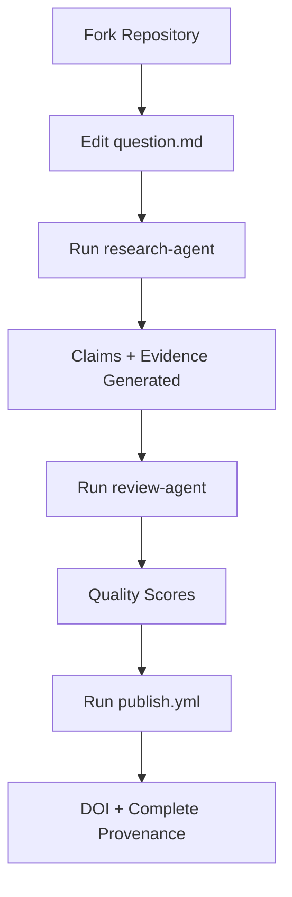

# CoResearcher
## Agent-Native Research Workflow with Complete Traceability

**Reproduce. Validate. Publish. All with DOI.**

---

## The Problem Today

Researchers using AI assistants face:
- ❌ Lost context between chat sessions
- ❌ No reproducible methodology
- ❌ Unclear evidence sources
- ❌ No credit for coordination work
- ❌ Manual artifact publishing

---

## The CoResearcher Solution

A **GitHub-native workflow** where every action is logged automatically and reproducible.

```text
Fork template → Ask question → AI agents work → Get DOI
```

---

## 3 Simple Commands, Complete Traceability

```bash
# 1. Run literature extraction
gh workflow run research-agent.yml --field question="Your question" --field query="search terms"

# 2. Validate with review
gh workflow run review-agent.yml

# 3. Publish with DOI
gh workflow run publish.yml
```

**Result**: Preprint on Zenodo with complete provenance.

---

## What's Included

- **question.md** - Edit with your research question
- **research-agent.yml** - Literature extraction with Claude/Gemini
- **review-agent.yml** - Automated quality assessment
- **publish.yml** - One-click DOI publication
- **actions/** - Auto-generated execution logs
- **artifacts/** - Auto-generated research outputs

---

## The Workflow



---

## Coming Soon

- More domain templates (cancer, genomics, neuro)
- More agent workflows
- Better provenance extraction
- Collaborative review features

---

## Get Started

1. Fork [coresearcher/alzheimer-biomarker-research](https://github.com/coresearcher/alzheimer-biomarker-research)
2. Edit `question.md`
3. Run workflows
4. Get your DOI

---

## No Infrastructure Required

- ✅ ORCID for identity (free)
- ✅ GitHub for versioning (free for open source)
- ✅ GitHub Actions for execution (free tier)
- ✅ Zenodo for publication (free)

---

*CoResearcher = Git for reproducible AI-assisted research*